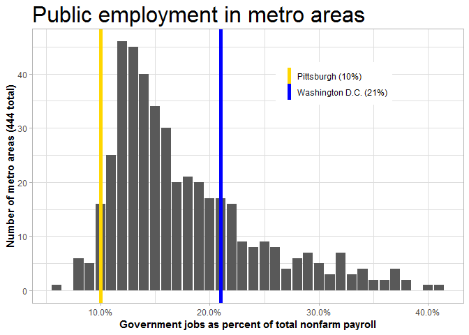

This is a shift share analysis using employment by industry for what the Bureau of Labor Statistics defines as major labor markets. The data comes from the BLS.

Annnual employment
==================

I'm going to start with the annual file and the code files

Prep
----

First, replace codes with words and rearrange columns to get a more readable tibble.

In a previous iteration, I found out once I started analyzing numbers that the industry codes also include the supersector codes, which makes it harder to filter to supersector totals. For example, all the Government industry codes start with '90'. I'm going to remove the supersector codes (the first two digits) from the industry codes. I waited until after I did the merge because the code files use the eight-digit code.

Preliminary analysis
====================

Let's get a feel for what is in the tibble.

    ## # A tibble: 10 x 3
    ##    col_name         col_type  col_unique_vals
    ##    <chr>            <chr>               <int>
    ##  1 state_code       character              52
    ##  2 state_name       character              52
    ##  3 area_code        character             444
    ##  4 area_name        character             444
    ##  5 supersector_code character              22
    ##  6 supersector_name character              22
    ##  7 industry_code    character             217
    ##  8 industry_name    character             238
    ##  9 year             integer                12
    ## 10 value            double               7885

Year currently has 12 unique values, so 12 years of data.

State codes and names have 52 unique values. Turns out the data includes several metros in Puerto Rico.

The area\_code and area\_names values show that we have 444 metros total with data on 22 supersectors and 238 industries (including aggregates such as Total Nonfarm).

The BLS has a "Total Private" and "Total Nonfarm" supersector but not a "Total Public" or "Total Government" supersector. Of course, you can get that number by subtracting Total Private from Total Nonfarm.

Basic questions
---------------

What is the range for the percent of a metro's employment that is public sector? What is the range if you exclude D.C.? Has the range changed over time? Have the metros with the highest and lower government employment changed over time (other than D.C. which obviously will have the highest)?

``` r
range(metro_gov$pct_government)
```

    ## [1] 0.06 0.42

Surprisingly, D.C. doesn't have the highest percent of government employees

``` r
metro_gov %>% 
  filter(pct_government == 0.06 | pct_government == 0.42) %>% 
  group_by(area_name)
```

    ## # A tibble: 6 x 10
    ## # Groups:   area_name [3]
    ##   area_name  year priv_goods government priv_svc nonfarm private
    ##   <chr>     <int>      <dbl>      <dbl>    <dbl>   <dbl>   <dbl>
    ## 1 Ames, IA   2009        5.7       19.7     41.5    47.1    27.4
    ## 2 Ames, IA   2010        5.5       19.7     41.3    46.8    27.1
    ## 3 Ames, IA   2011        5.7       19.8     41.8    47.5    27.7
    ## 4 Ames, IA   2012        5.9       20.3     42.6    48.5    28.2
    ## 5 Elkhart-~  2017       71.4        8.6     66.4   138.    129. 
    ## 6 Hinesvil~  2012        2.3        8.3     17.7    20      11.7
    ## # ... with 3 more variables: pct_government <dbl>, pct_goods <dbl>,
    ## #   pct_svc <dbl>

What's the breakdown on this?

``` r
ref_gov <- metro_gov %>% 
  filter(area_name %in% c('Pittsburgh, PA','Washington-Arlington-Alexandria, DC-VA-MD-WV'),
         year==2017) %>% 
  select(area_name, pct_government) %>% 
  mutate(area_name_r = paste0(ifelse(area_name == 'Pittsburgh, PA',"Pittsburgh", "Washington D.C.")," (",round(100*pct_government,digits=1),"%)"))

metro_gov %>%
  filter(year==2017) %>% 
  ggplot(aes(x=pct_government)) +
  geom_bar() +
  geom_vline(data=ref_gov, aes(xintercept=pct_government,color=area_name_r),size=2) +
  labs(title="Public employment in metro areas",
       x="Government jobs as percent of total nonfarm payroll",
       y="Number of metro areas (444 total)") +
  scale_x_continuous(labels=scales::percent) +
  scale_color_manual(values=c('gold','blue')) +
  theme_light() +
  theme(legend.position=c(.7,.8),
        legend.direction='vertical',
        legend.title=element_blank(),
        text=element_text(family='Helvetica'),
        plot.title=element_text(size=24),
        axis.title=element_text(face='bold'))
```


